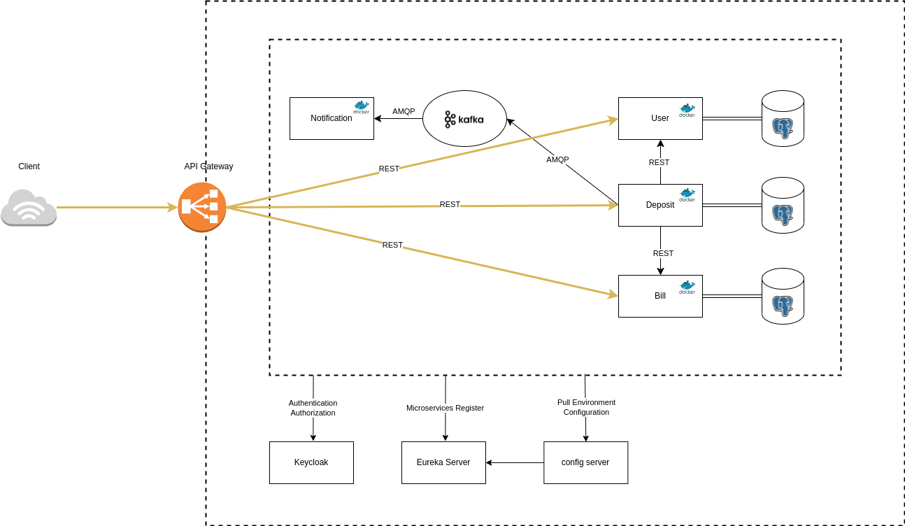
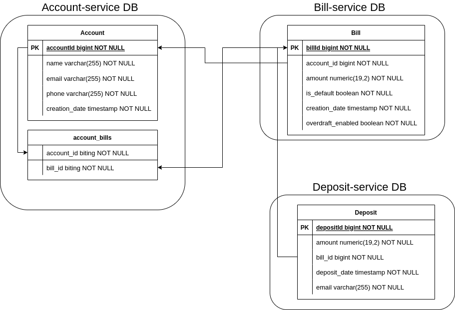

# Book-Store App (Spring Boot Microservice)

На первом этапе создания приложения основное внимание уделим сервису платежей.

Далее планируется создание сервиса товаров, их инвентаризация и сервисы заказов

# Связи сущностей

В качетсве отправной точки возьмем данную модель. Впоследствии таблицы будут меняться и дополняться новыми

